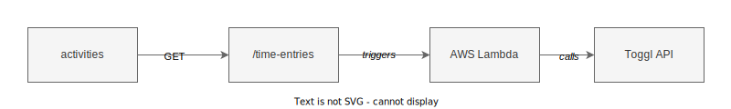

# activities

Return data from the [Toggl](https://track.toggl.com/) time tracking service.


| Endpoint | Request type |
| --------------- | ------------ |
| `/time-entries` | GET |

## Environment variables

| Variable             | Description                               |
| -------------------- | ----------------------------------------- |
| `TOGGL_API_KEY`      | API key for accessing Toggl data          |
| `TOGGL_WORKSPACE_ID` | Workspace ID comprising multiple projects |

## `time-entries`

Return an array of time entries of professional development activities, e.g.:

```json
[
  {
    "project": "Practical study",
    "date": "2023-10-15",
    "duration": "0.24",
    "task_description": "typehinting python"
  }
]
```

### Query parameters

| Parameter    | Values                                |
| ------------ | ------------------------------------- |
| `date_range` | `week`, `month`, `six_months`, `year` |
