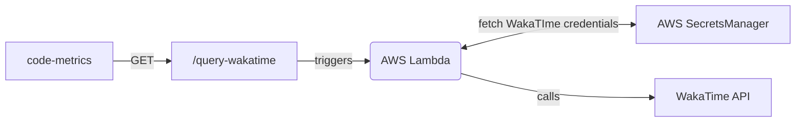

# code-metrics

Return data from a variety of third-party APIs to create [dashboard](https://systemsobscure.blog/code-metrics/) of my coding activity.

| Endpoint          | Request type |
| ----------------- | ------------ |
| `/query-wakatime` | GET          |

## `query-wakatime`

### Query parameters

| Parameter    | Values                                                      |
| ------------ | ----------------------------------------------------------- |
| `timePeriod` | `last_7_days`, `last_30_days`, `last_6_months`, `last_year` |
