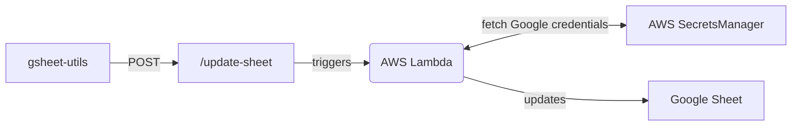

# gsheet-utils

Utilities for interacting with the Google Sheets API.



| Endpoint        | Request type |
| --------------- | ------------ |
| `/update-sheet` | POST         |

### `update-sheet`

```json
// Example body
{
  "worksheet": "worksheet_name",
  "data": [
    {
      "date_added": "1689023491",
      "article_title": "Lorem ipsum",
      "article_excerpt": "Ut enim ad minim veniam, quis nostrud exercitation...",
      "link": "https://www.example.com"
    }
  ]
}
```
