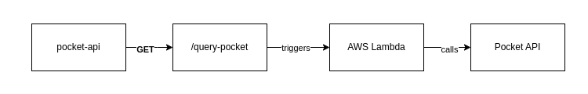

# pocket-api

Return saved [Pocket](https://getpocket.com) articles by tag.

| Endpoint        | Request type |
| --------------- | ------------ |
| `/query-pocket` | GET          |

## `query-pocket`

### Query parameters

| Parameter | Values                                    |
| --------- | ----------------------------------------- |
| `tag`     | `website`, `general`, `technical`, `gaby` |

### TODO

- [ ] Add unit test for when non-existent tag is passed.
