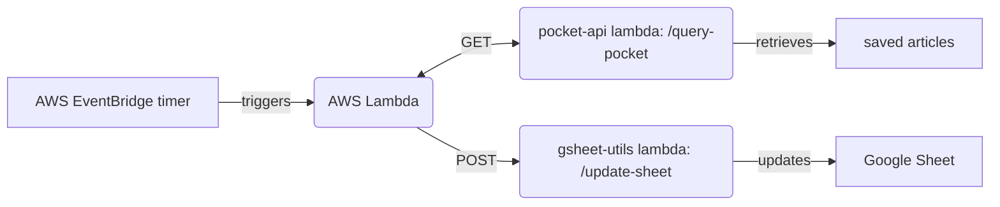

# save-articles

Retrieve articles by tag from the Pocket API and inject into Google Sheets worksheet.

## Environment variables

| Variable                  | Description                                                                                                     |
| ------------------------- | --------------------------------------------------------------------------------------------------------------- |
| `POCKET_LAMBDA_ENDPOINT`  | AWS API Gateway endpoint for [pocket-api lambda](https://github.com/thomasabishop/lambdas/tree/main/pocket-api) |
| `GSHEETS_LAMBDA_ENDPOINT` | AWS API Gateway endpoint for [gsheet-utils lambda]()                                                            |
